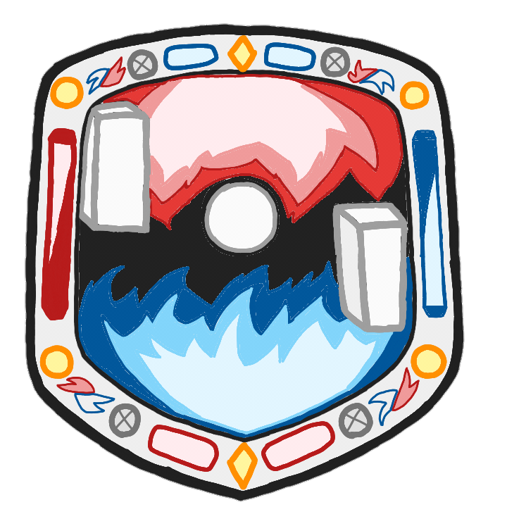
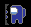
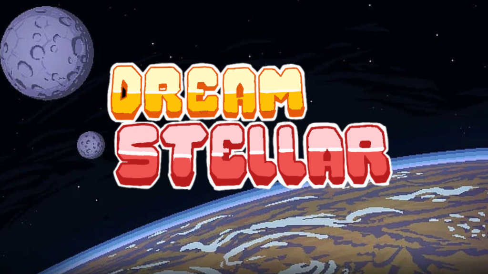
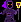
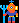
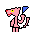
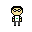
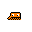
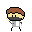

# Dream Stellar
- es un juego con varias mecanicas simples y divertidas como un bot, el movimiento del jugador y el rebote de la pelota
    - bot: el bot es un codigo con el cual el jugador se va ha enfrentar 
    - movimiento del jugador: el jugador va a tener dos simples movimientos los cuales van ha hacer ir hacia arriba y ir hacia abajo para poder hacer rebotar la pelota
    - el rebote de la pelota el es un programa el cual traje con las coordenadas de la cancha y las de el jugador y el bot 
## integrantes 
los integrantes del grupo del juego son 
- lider:
    julian camilo sanchez triana
- miembros:
    Oscar Eduardo Sanchez Payarez
    Santiago Ángel Ramón

### informacion
- correos electronicos
    - santiago: santiagoangel@colegioguanenta.edu.co
    - oscar: oscarsanchez1@colegioguanenta.edu.co
    - julian: juliansanchez2@colegioguanenta.edu.co

- colegio: colegio San José de Guanenta
- especialidad: sistemas-1 2025

# objetivo del juego

el objetivo del juego es gnarle a un amigo en un juego de pingpong en el cual los personajes son dos among us uno rojo y otro azul.

# mecanicas

las mecnicas son dos las cuales son: 
- la pelota:
    - tiene dos variables son "XX3" y "YY3" ls cuales son la coordenada "x" y "y" respectivmente
    - la pelota se mueve utilizando dos variables "movimientoX" y "movimientoY" las cuales hacen que la pelota su mueva en diagonal.

- jugador1:
    - el jugador1 tiene dos varibles igual que la pelota "XX1" y  "YY1" los cuales pueden ser modificados al presionar las teclas "w, a, s, d" para el movimiento del personaje.

- jugador2:
    - el jugador1 tiene dos varibles igual que la pelota "XX2" y  "YY2" los cuales pueden ser modificados al presionar las teclas de as flechas para el movimiento del personaje.

# variables
- en el juego se utilizan muchas variables:
    - XX1
    - YY1
        - movimiento del jugador 1
    - XX2
    - YY2
        - movimiento del jugador 2
    - XX3
    - YY3
        - movimiento de la pelota
    - XX4
    - YY4
    - movimientoY
    - movimientoX
    - clock
        - variable utilizada para cargar los fps.
    - ventana
        - es la variable utilizada para cargar la ventana en la cual aparece y carga el juego.
    - tiempo
        - variable utilizada para la pantalla de carga.
    - puntos_1
    - puntos_2
        - puntos hechos por los jugadores.

    - tiempo4
        - es utilisado para poder utilizar la tienda.
    - musica
    - XX23
    - XX24
    - YY23
    - YY24
    - logo
        - es la imagen que aparece en la mitad del campo de juego.

            
    - rojo_player
        - es la imagen del jugador 1

            
    - azul_player
        - es la imagen del jugador 2

            
    - carga
        - es la imagen que aparece al iniciar el juego

            

    # peronajes de la tienda
    - mago
        - es una skin del jugador 1

            
    - aquaman
        - es una skin del jugador 2

            
        
        # publico

        - panterarosa
            - es la imagen de la pantera rosa en el publico que aparece en la parte inferior derecha de la pantalla

            

        - cualquierpersona   
            - es una persona que aparece en el publico en la parte inferior izquierda de la pantalla

             

        - pepe
            - pepe es un personaje parecido a Qbert que aparece en el publico que aparece en la parte superior derecha de la pantalla

            

        - alien
            - son los aliens que aparecen en el publico

            

        - by 2002(aquino)
            - aquino es un persoanje que aparece en el publico estando en lña parte superior izquierda de la pantalla

            
        
    # colores
    - amarillo = (187, 173, 4)
    - rojo = (255, 0, 0)
    - azul = (0, 0, 255)
    - blanco = (255, 255, 255)
    - negro = (0, 0, 0)
    - amarilo_oscuro = (142, 130, 10 )
    - verde = (0, 255, 255)
    - rosado = (255, 195, 203)
    - naranja = (194, 88, 0)
    - cian = (0, 255, 255)
    - gris = (118, 120, 119)
    - gris_oscuro = (80, 81, 81)
    - gris_mas_oscuro = (58,59,58)
    - gris_claro = (198, 200, 199)
    - rosadito = (197, 71, 56)
    - morado = (145, 74, 201 )
    - cafe = (91, 10, 10 )
    - morado_puro = (131, 0, 255)

# versiones
- versión 1
- versión 2
- versión 3
- versión 4
- versión 5
- versión 6.0
- versión 6.1
- versión 6.2
- versión 7
- versión 8.0
- versión 8.1
- versión 9
- versión 10
- version 11
- version 12

## versión 1
en esta version se creo el mapa, los personajes los cuales eran rectangulos y el movimiento de los personajes.

## versión 2
en esta version se pusieron los limites de los personajes para que no se salgan del mapa y se puso la pelota la cual no se movia.

## versión 3
en esta versión se puso el movimiento de la pelota, el marcador el cual no funciona y las coliciones.

## versión 4
se puso la pantalla de carga y el logo del juego en mitad de la cancha.

## versión 5 
al juego se le puso musica de carga.

## versión 6.0
se cargo la imagen del jugador 1.

## versión 6.1
se cargo la imagen del jugador 2.

## versión 7
es una versión muy dificil del juego ya que la velocidad de la pelota aumento y se quito la pantalla de carga por una pantalla de inicio.

## versión 8.0
en esta versión se hiso que la colision de la pelota con los personajes fuera manual.

## versión 8.1
se arreglo un bug con el personaje 2.

## versión 9
el marcador funciona y la partida acaba a los 5 puntos de cualquier personaje.

## versión 10
esta versión fue de arreglo de buga

# version 11
en est version se actualiso el fondo del juego

# version 12
en esta version se creo la tienda con dos personajes nuevos